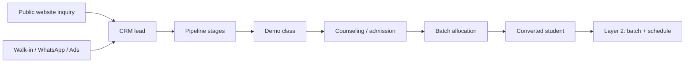
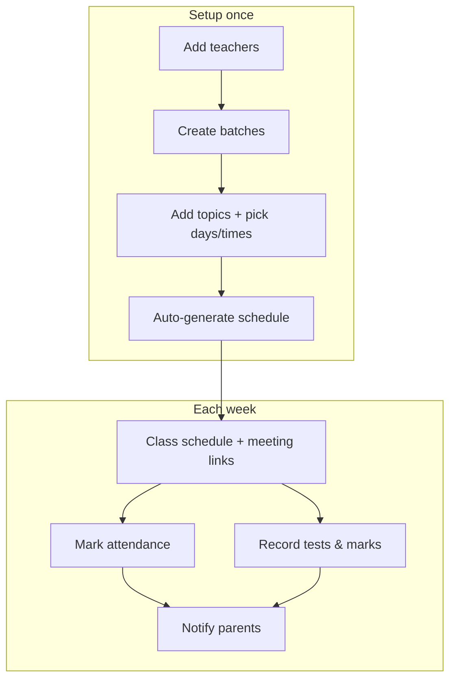
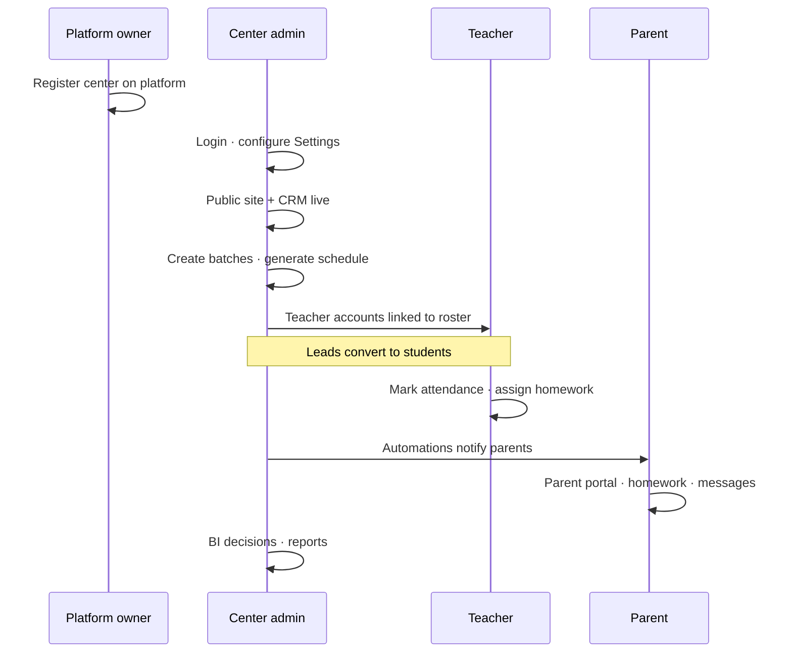
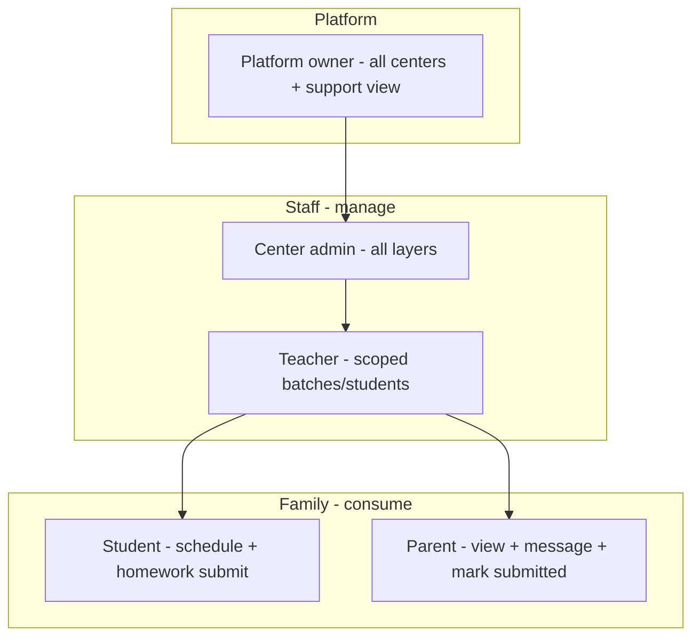

# EduOS — Workflow & High-Level Design

**Product:** EduOS (tutor-hub)  
**Type:** Tutoring **operations** platform — not an LMS  
**Version:** MVP demo (local-first, multi-tenant)

---

## 1. What EduOS Is

EduOS is the **operating system for tuition centers**. It handles everything *around* teaching:

- Acquiring and enrolling students (CRM)
- Running batches, schedules, attendance, and tests
- Messaging parents and staff
- Tracking student/tutor success signals
- Business intelligence and decisions
- Connecting external tools (Zoom, WhatsApp, calendars)

**Teaching itself** (live classes, worksheets, course content) happens on the tutor’s own platforms (Zoom, Google Meet, Khan Academy, etc.). EduOS coordinates logistics and visibility.

```
┌─────────────────────────────────────────────────────────────┐
│                    PLATFORM OWNER (EduOS)                   │
│   Onboard centers · Monitor usage · Support view            │
└──────────────────────────┬──────────────────────────────────┘
                           │ many centers
         ┌─────────────────┼─────────────────┐
         ▼                 ▼                 ▼
   ┌───────────┐    ┌───────────┐    ┌───────────┐
   │ Center A  │    │ Center B  │    │ Center C  │
   │ (tenant)  │    │ (tenant)  │    │ (tenant)  │
   └───────────┘    └───────────┘    └───────────┘
         │                 │
    Admin · Teachers · Students · Parents (scoped data)
```

---

## 2. Design Principles

| Principle | Meaning |
|-----------|---------|
| **Ops-first** | CRM, schedule, attendance, comms — not course hosting |
| **Multi-tenant** | Each center’s data is isolated by `centerId` |
| **Role-based portals** | Same app, different nav and permissions per role |
| **Decisions, not dashboards** | BI layer suggests *what to do next* |
| **Local MVP** | Data in browser `localStorage`; run via `start.bat` |

**Deferred:** Payments / billing layer (Layer 10 removed from roadmap).

---

## 3. Roles & Portals

Each user logs in through a **portal tile** on the auth home screen. Sessions are stored in `localStorage` (`tutorhub_session`).

| Role | Who | Default landing | Data scope |
|------|-----|-----------------|------------|
| **Platform owner** | EduOS operator | Platform dashboard | All centers; optional **support view** into one center |
| **Center admin** | Academy owner / manager | Command dashboard | Full center workspace |
| **Teacher** | Tutor | Teacher Today | Own batches & students only |
| **Student** | Learner | Student home | Own profile, schedule, homework |
| **Parent** | Guardian | Parent dashboard | Linked child(ren) only |

### Platform owner support view

1. **All centers** → open a center → **Support view**
2. Nav switches to center-admin menus; data scoped to that center
3. **Back to platform** exits support view

### Center registration

New centers register on the auth screen → creates center + center admin user → empty scoped workspace.

---

## 4. The Nine Layers

Each layer maps to a sidebar section for **center admin**. Teachers and parents see subsets.

| Layer | Name | Purpose |
|-------|------|---------|
| **1** | Education CRM | Public site, leads, pipeline, enrollment |
| **2** | Academy OS | Batches, schedule, teachers, students, attendance, tests |
| **3** | Communication | WhatsApp, email, SMS, automations |
| **4** | Student Success | Journeys, homework, interventions, certificates |
| **5** | Tutor Success | Lesson plans, homework review, tutor performance, PD |
| **6** | Parent Experience | Parent dashboard, progress, messages, preferences |
| **7** | AI Assistants | Rule-based / optional GPT insights and drafts |
| **8** | Business Intelligence | KPIs, trends, owner decisions |
| **9** | Extensions & Partners | Integrations (Zoom, calendar), templates, partners |

---

## 5. Core Workflows

### 5.1 Lead → Student (Layer 1)



**CRM pipeline stages:** Lead → Inquiry → Demo → Counseling → Admission → Payment → Batch allocation → Student

**Key actions:**
- Capture inquiries from **Public Website** form (writes to CRM)
- Tab views: Pipeline, All leads, Follow-ups
- Log activities, schedule demos, move stages
- **Enroll** converts lead → student (pick batch)
- WhatsApp follow-up from lead detail

---

### 5.2 Daily academy operations (Layer 2)



**Batch auto-schedule:**
1. Create batch, assign teacher
2. Pick weekdays + start/end time
3. Enter topics (one topic = one session)
4. **Auto-generate** → dated sessions with meeting links (Meet / Zoom / Teams)
5. **Mark done** on completed classes

**Attendance:** Per batch, per date — present / absent / late → optional parent WhatsApp.

**Tests:** Record marks per student → averages and reports.

---

### 5.3 Homework & student success (Layers 4 & 5)

**Who can create homework, issue certificates, add feedback:**

| Action | Center admin | Teacher | Parent | Student |
|--------|:------------:|:-------:|:------:|:-------:|
| + Assignment | ✓ | ✓ | — | — |
| Issue certificate | ✓ | ✓ | — | — |
| + Feedback | ✓ | ✓ | — | — |
| Submit homework | — | — | mark submitted | submit |
| View only | — | — | ✓ | ✓ |

**Staff paths:**
- **Student Success** — full engine: overview, journey, interventions, assignments, parent summary
- **Tutor Success** — lesson plans, homework review, schedule, PD

**Parent / student paths:**
- **Homework** tab — read-only list (parent) or submit (student)
- No admin toolbar on parent login

---

### 5.4 Communication (Layer 3)

Event-driven messaging across channels:

- **Channels:** WhatsApp, email, SMS, push (simulated in demo)
- **Templates & automations:** absence alerts, test results, homework due, class reminders
- **Comm Hub:** send broadcasts, configure settings, view message log
- **Quick Message** in top bar → jumps to comm hub (role permitting)

WhatsApp can run in **simulate** mode (no API key) or **live** mode (Meta API credentials in Settings).

---

### 5.5 Parent experience (Layer 6)

Parent portal tabs:

| Tab | Content |
|-----|---------|
| Home | Success score, next class, recent activity, contact teacher |
| Progress | Strengths, skills, test history |
| Homework | Assignments and status |
| Attendance | History and rate |
| Feedback | Teacher notes |
| Messages | Center ↔ parent thread |
| Settings | Notification preferences |

Parents can **request progress summary** and **mark homework submitted** (parent confirmation, not grading).

---

### 5.6 Intelligence & AI (Layers 7 & 8)

**Business Intelligence**
- Decisions feed: what the owner should do today (at-risk students, follow-ups, capacity)
- KPIs, trends, predictions, lead analytics
- Differs from raw reports — action-oriented cards

**AI Assistants**
- Role-aware chat (owner, tutor, parent, student contexts)
- **Rule-based** by default; optional **OpenAI** key in Settings
- Drafts parent messages, surfaces insights from attendance/tests

---

### 5.7 Extensions (Layer 9)

Not a content marketplace. Instead:

- **Connections:** Zoom, Google Calendar, Twilio, etc.
- **Templates:** Ops message templates
- **Partners:** Partner service catalog

Install/connect flows update center configuration; teaching content stays external.

---

## 6. End-to-End Journey (New Center)



---

## 7. Technical Architecture

```
index.html
  └── js/app.js          Auth gate, navigation, modals, session shell
        ├── auth.js        Login, register center, platform support view
        ├── auth-views.js  Login / register UI
        ├── portals.js     Role nav config & access control
        ├── store.js       Data layer (localStorage v5, multi-tenant)
        ├── views.js       Center admin pages (dashboard, CRM shell, academy)
        ├── layer-views.js Layers 3–9 + public site UI
        ├── platform-views.js Platform owner + teacher/student home
        ├── crm.js         CRM stats & search helpers
        ├── academy.js     Layer 2 banners & stats
        ├── scheduler.js   Auto-schedule & session helpers
        ├── platform.js    Layer 4–6 data (assignments, parent prefs, etc.)
        ├── communication.js / whatsapp.js
        ├── intelligence.js / ai.js
        └── ...
```

### Data model (high level)

| Entity | Scoped by | Notes |
|--------|-----------|-------|
| `centers[]` | platform | Tenant root |
| `users[]` | center (+ platform owner) | Roles, linked teacher/student IDs |
| `centerSettings{}` | center | Per-center Settings |
| `batches`, `students`, `teachers` | centerId | Core roster |
| `leads` | centerId | CRM pipeline |
| `attendance`, `tests`, `messages` | centerId | Ops records |
| Platform extensions | center (MVP gap for brand-new centers) | assignments, marketplace, etc. |

Session key: `tutorhub_session` · Data key: `tutorhub_data_v5`

### Running locally

1. Double-click **`start.bat`** (keep window open)
2. Open **http://127.0.0.1:8888/**
3. Do **not** open `index.html` via `file://` — ES modules require a local server

---

## 8. Demo Accounts

Password for all: **`demo123`**

| Portal | Email |
|--------|-------|
| Platform owner | `owner@eduos.app` |
| Center admin | `admin@brightminds.demo` |
| Teacher | `anita@tutorhub.com` or `vikram@tutorhub.com` |
| Student | `aarav@email.com` |
| Parent | `rajesh@email.com` |

Demo centers: **Bright Minds Academy** (full seed data) · **Excel Tutors Pune** (empty, for platform list).

**Reset demo data:** Settings → Reset Demo Data

---

## 9. Permission Summary



---

## 10. Out of Scope (Current MVP)

- Payment collection and invoicing
- Hosting course videos or worksheet libraries
- Production backend / real multi-user sync
- Mobile apps (responsive web only)
- Full API enforcement (API keys & webhooks are demo UI)

---

## 11. Suggested Reading Order for New Users

1. Log in as **center admin** → Dashboard → understand command center
2. **CRM** → follow one lead through to enrollment
3. **Batches** → auto-schedule → **Class Schedule**
4. **Attendance** + **Tests** → **Communication Hub**
5. Log in as **teacher** → Today → mark attendance → assign homework
6. Log in as **parent** → dashboard → homework (read-only admin actions)
7. Log in as **platform owner** → all centers → support view into Bright Minds

---

*Document reflects the tutor-hub codebase as of the multi-tenant auth release. Update when layers or roles change.*
